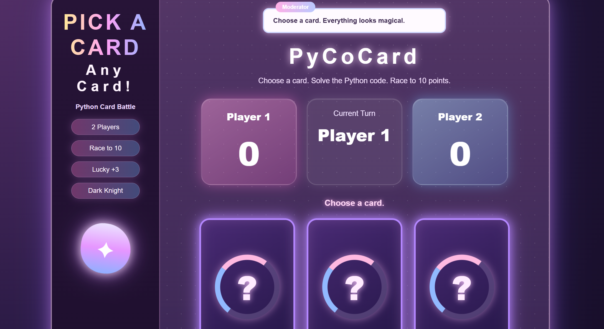
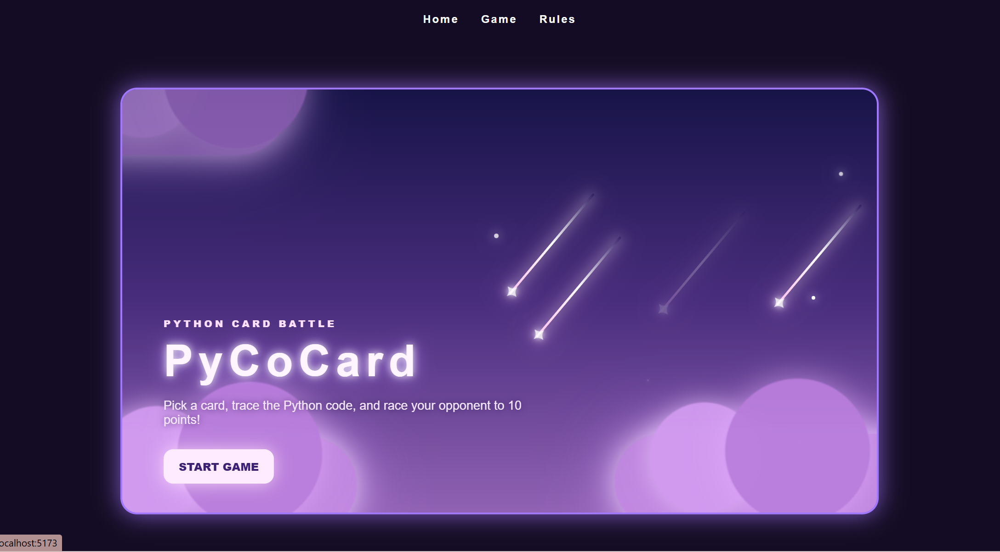
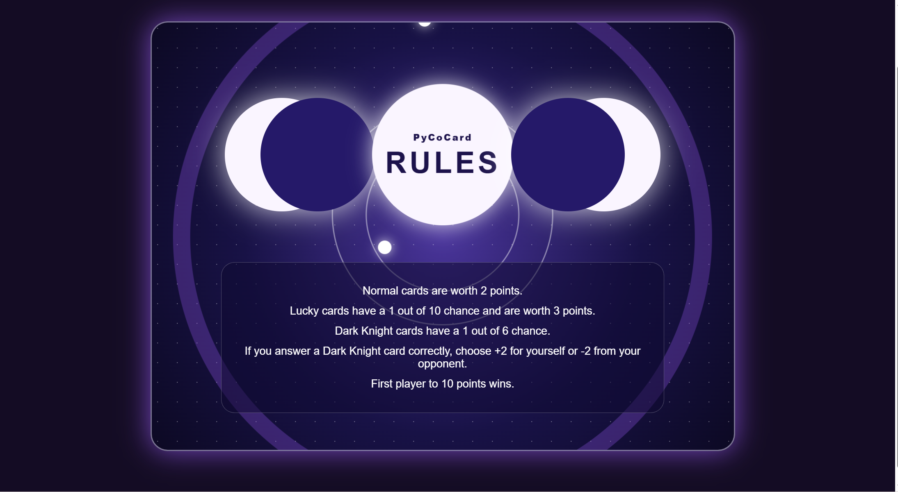

# Pyco Card

Pyco Card is a React + Vite coding card game designed to make learning Python fun while helping future software engineers prepare for technical interviews.

Players pick cards and answer coding-related questions in a game-like format.

---

# Features

- Interactive coding card game
- Python-based questions
- Score tracking
- Beginner-friendly interface
- Built with React Vite and CSS

---

# To play or try out the game
# Here is a live demo:

https://py-co-card.vercel.app/

---

# Technologies Used

- React
- Vite
- CSS
- JavaScript

---

# Future Plans

- Add LeetCode-style questions
- Add multiplayer support
- Add difficulty levels
- Add timer and leaderboard system
- Add backend/database support

---

# Purpose

Pyco Card was created to help students feel less intimidated by coding and technical interviews by turning programming practice into a fun interactive game.